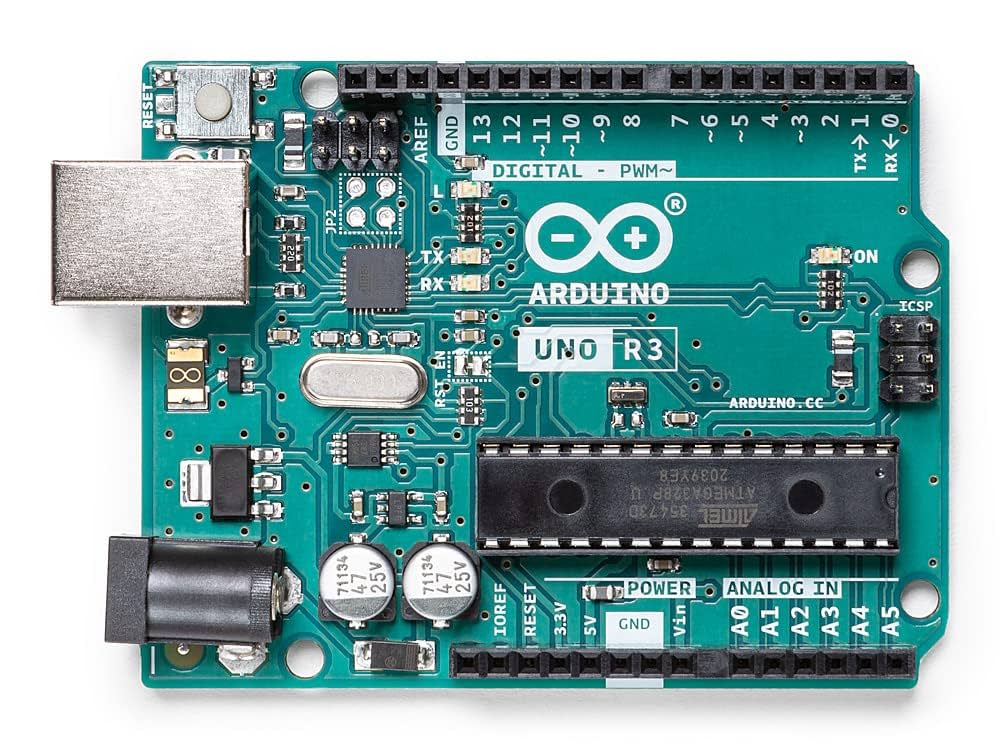

| شماره | نام قطعه                       | توضیح کامل عملکرد                                                                                       |
| ----- | ------------------------------ | ------------------------------------------------------------------------------------------------------- |
| 1️⃣   | **USB Type-B Connector**       | اتصال برد به کامپیوتر برای: ۱. آپلود برنامه ۲. تأمین تغذیه ۳. ارتباط سریال                              |
| 2️⃣   | **پورت تغذیه (DC Jack)**       | برای تغذیه آردوینو با آداپتور (مثلاً ۹ تا ۱۲ ولت) زمانی که به USB وصل نیست                              |
| 3️⃣   | **میکروکنترلر ATmega328P**     | مغز اصلی آردوینو، تمام برنامه در این چیپ اجرا می‌شود. حافظه فلش ۳۲KB، SRAM، و تایمر دارد                |
| 4️⃣   | **Voltage Regulator**          | کاهش و تثبیت ولتاژ ورودی به ۵V یا ۳.۳V برای قطعات حساس داخلی                                            |
| 5️⃣   | **کریستال نوسان‌ساز (16 MHz)** | تولید سیگنال ساعت (Clock) برای تنظیم سرعت اجرای دستورات                                                 |
| 6️⃣   | **پایه‌های دیجیتال (0 تا 13)** | ورودی/خروجی دیجیتال. با دستور `digitalRead` و `digitalWrite` کنترل می‌شن. پایه‌های \~ دار، PWM هم دارند |
| 7️⃣   | **پایه‌های آنالوگ (A0 تا A5)** | فقط ورودی آنالوگ هستند. می‌تونن ولتاژ رو بین ۰ تا ۵ ولت بخونن (با `analogRead`)                         |
| 8️⃣   | **LED داخلی پایه 13**          | LED کوچکی که به پایه دیجیتال 13 متصل است. با `digitalWrite(13, ...)` کنترل می‌شود                       |
| 9️⃣   | **دکمه Reset**                 | راه‌اندازی مجدد برد. اگر برنامه هنگ کرده یا برای شروع از اول بخوای برنامه اجرا شه                       |
| 🔟    | **پایه‌های تغذیه (Power)**     | شامل:                                                                                                   |

* **5V** (تغذیه مستقیم سنسورها)
* **3.3V** (برای ماژول‌های حساس‌تر)
* **GND** (زمین)
* **Vin** (برای تغذیه خارجی از ۷–۱۲ ولت) |
  \| 🔁 | **پایه‌های سریال (TX:1، RX:0)** | برای ارتباط سریال (با کامپیوتر یا ماژول‌های دیگر مثل بلوتوث) |
  \| 🔁 | **پایه‌های ICSP (بالا سمت راست)** | مخصوص برنامه‌ریزی مستقیم ATmega328P با پروگرامر خارجی |
  \| 📌 | **پایه AREF** | برای تعیین مرجع ولتاژ ورودی آنالوگ. معمولاً استفاده نمی‌شه مگر پروژه‌های حساس |
  \| 🔋 | **خازن‌ها (Capacitors)** | برای فیلتر ولتاژ و جلوگیری از نویز در تغذیه برد |
  \| 🔗 | **IOREF** | ولتاژ مرجع برای شیلدهای Arduino (مثلاً بعضی ماژول‌ها از این پایه استفاده می‌کنن) |
  \| 💡 | **LED‌های وضعیت (TX, RX, ON)** |
* **ON**: نشان‌دهنده تغذیه فعال برد
* **TX/RX**: چشمک‌زن هنگام ارسال/دریافت داده سریال |

---

## 🧠 برخی نکات مفهومی

### ✔️ پایه‌های PWM (پایه‌هایی که کنارشون \~ هست مثل 3، 5، 6، 9، 10، 11)

* این پایه‌ها می‌تونن سیگنال شبه آنالوگ تولید کنن.
* برای کنترل شدت نور LED، سرعت موتور و... استفاده می‌شن.

---

### ✔️ پایه‌های آنالوگ (A0 تا A5)

* فقط ورودی هستن.
* داده‌ها رو به صورت عدد بین 0 تا 1023 می‌خونن (10 بیت)
* مثلاً اگه ۵ ولت بدی به A0 → خروجی `analogRead(A0)` برابر با 1023 می‌شه.

---

### ✔️ پایه‌های تغذیه

| پایه | کاربرد                                                   |
| ---- | -------------------------------------------------------- |
| 5V   | برای تغذیه ماژول‌ها و سنسورها (مثلاً LCD، رله)           |
| 3.3V | مخصوص سنسورهای حساس (مثلاً ESP8266)                      |
| GND  | پایه زمین، باید حتماً مشترک با سایر مدارها باشه          |
| Vin  | ورودی تغذیه وقتی از آداپتور استفاده می‌کنی (مثلاً ۹ ولت) |

---

### ✔️ ICSP Header

* برای برنامه‌ریزی مستقیم میکروکنترلر با استفاده از پروگرامر حرفه‌ای مثل USBasp
* معمولاً لازم نیست مگر بخوای بوت‌لودر رو دوباره بنویسی

---

## 🎯 خلاصه‌سازی دیداری (بر اساس عکس بالا)

```
 ┌────────────────────────────┐
 │ USB           RESET        │ ← آپلود کد / ریست برد
 │  ⬛                      ◼ │
 │     Arduino UNO R3         │
 │                            │
 │ D0 → RX  ⟶⟶⟶⟶⟶⟶ D13 → LED │ ← پایه‌های دیجیتال (0 تا 13)
 │ A0 تا A5                  │ ← پایه‌های آنالوگ
 │ 5V / 3.3V / GND / Vin     │ ← پایه‌های تغذیه
 │                            │
 │ میکروکنترلر ATmega328P   │ ← مغز برد
 │                            │
 └────────────────────────────┘
```
